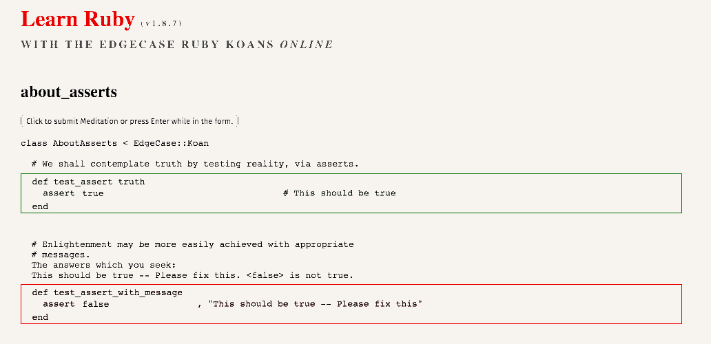

# Try out all the things

A collection of beginner-friendly, browser-based learning resources (some are even interactive)

- [JavaScript](#javascript)
- [CSS](#css)
- [Git](#css)
- [Ruby](#ruby)
- [Network](#network)

If you know something I should add, [tell me about it](https://github.com/filtercake/try-out-all-the-things/issues/new).

---

## JavaScript

### [Elevator Saga - the elevator programming game](http://play.elevatorsaga.com/)

### [Smooth CoffeeScript](https://autotelicum.github.io/Smooth-CoffeeScript/) / [Eloquent JavaScript](http://eloquentjavascript.net/)

## CSS

### [CSS Diner](http://flukeout.github.io/)

### [Flexbox Froggy](http://flexboxfroggy.com/)

### [CSS Specificity](http://cssspecificity.com/)

## Git

### [Try Git](https://try.github.io/levels/1/challenges/1)

## Ruby 

### [Try Ruby](http://tryruby.org/)]

### [Ruby Warrior](https://www.bloc.io/ruby-warrior/)

### [Ruby Koans](http://koans.herokuapp.com/en)

## Network

### [How DNS works](https://howdns.works/)

<link rel="stylesheet" href="https://afknapping.de/css.css">
